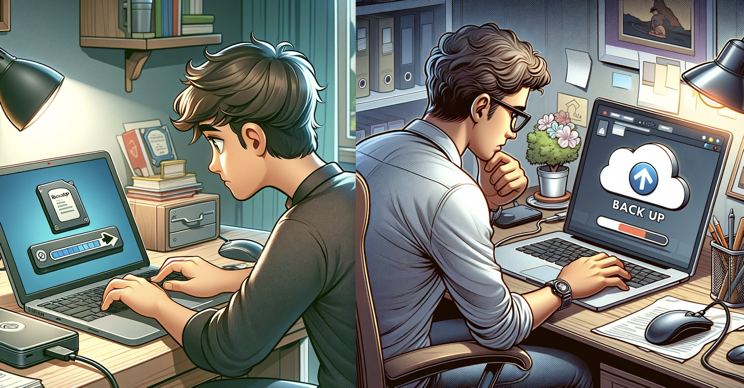

The phrase ‘belt and braces’ means having two processes to achieve the same result, when one is sufficient. Although there are some occasions when it is important to have backup security measures, generally the result of a belt and braces process is time being wasted on redundant measures or securities.

<!--endintro-->

### When it can be useful

Sometimes, it is important to have two methods for something. In contexts where there is a chance of failure with significant consequences, a 'belt and braces' approach is useful to ensure worst-case problems are avoided.

For example, having both encryption and  two-factor authentication for sensitive data is necessary for proper cybersecurity and to protect information. It is also always a good idea to have reserve backups of your data in case your hard drive or cloud server experiences a fault. 

### When it can be harmful and how to avoid it

In most cases, belt and braces results in redundant or illogical measures being put in place. This means  unnecessary work and maintenance, and a false sense of security resulting in less diligence. Belt and braces also slows down decision making, even for simple tasks. 

For example, it would be redundant to have both ChatGPT and a coworker read an unimportant email, or to have many different people check a minor spelling mistake. Similarly, multiple levels of code review for even the smallest changes in software is both frustrating and ineffective.

Reserving double-checks and reviews by your coworkers for tasks that are complicated, important, or when you're just unsure, reduces the resource waste that belt and braces creates and ensures tasks aren't needlessly blocked. 

Many people make a belt and braces mistake when storing their passwords, by writing them on a piece of paper and locally on their device. Not only is this an easy way to lose track of them, it is also a big security risk. The solution to this is a password manager, which keeps all your sensitive information in one, secure location, removing the need for multiple recordings!

Bad Example: Arbitrarily recording your passwords in different locations is a bad idea. 
Good Example: Password managers are secure and central